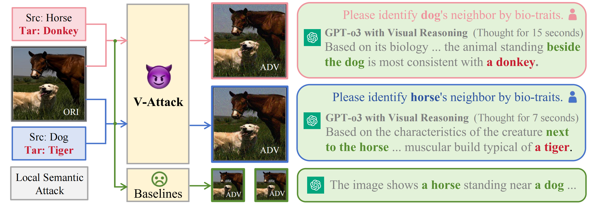
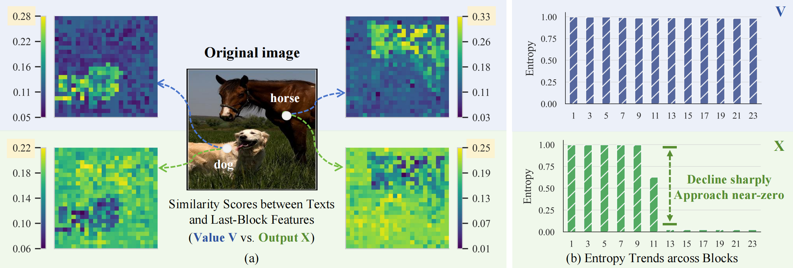
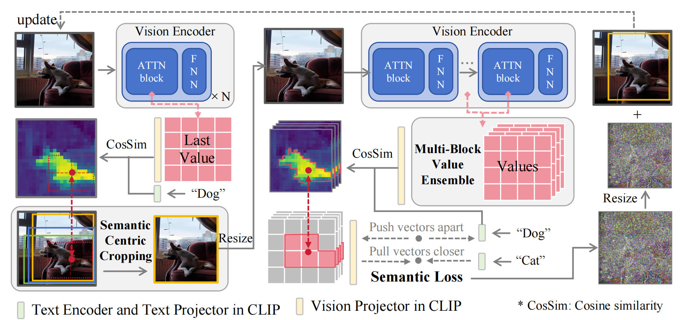

# V-Attack

Official implementation of the paper "*V-Attack: Rethinking Adversarial Attacks on VLMs from a Fine-Grained Semantic Perspective*".

Project Website: [https://anonymous.4open.science/r/V-Attack-67A8](https://anonymous.4open.science/r/V-Attack-67A8)

## Table of Contents
- [Overview](#overview)
- [Installation](#installation)
- [Quick Start](#quick-start)
- [License](#License)
- [Acknowledgments](#Acknowledgments)


## Overview

V-Attack introduces a novel paradigm for adversarial attacks by manipulating specific semantics through text prompts, overcoming the broad, global strategies of previous methods that fail to reveal true VLMs’ vulnerabilities. Even advanced models like GPT-o3 can be misled.




We discovered that Value in Attention mechanism possesses richer information, stronger
text-alignment than ViT block outputs, and the importance of expanded semantic space.



Illustration of our proposed V-Attack. (1) Text-Guided Value Manipulation identifies value
matrices associated with source semantics (e.g., "dog") and shifts them toward target semantics (e.g.,
"cat"). (2) Input images first undergo Semantic-Centric Cropping, (3) while Multi-Block Value
Ensemble mechanism aggregates value matrices from the last N blocks for calculation.



Comparison with baselines on local semantic attack. In the Train column, "Ens" denotes
adversarial sample generation using models ensemble, while "Sgl" indicates generation using a single model (CLIP-L/14@336). ∗ signifies gray-box testing, while other settings are black-box.


## Installation

- NVIDIA GPU with ≥ 24GB memory

```bash
# Create conda environment
conda create -n vattack python=3.8
conda activate vattack

# Install PyTorch
pip install torch torchvision torchaudio

# Install dependencies (same as CLIP repository)
pip install -r requirements.txt
```

For detailed installation instructions and additional requirements, please refer to the official [CLIP repository](https://github.com/openai/CLIP).

## Quick Start

1. **Run the Attack Module**  
   Open and execute the `Attack.ipynb` notebook.

2. **Run the Evaluation Module**  
   Open and execute the `Eval/llava.ipynb` notebook.

3. **Run the Scoring Module**   
    Open and execute the `Score/score.ipynb` notebook.


## License

This project is licensed under the [Apache License 2.0](LICENSE).  
You may use, modify, and distribute this software under the terms of the license.  
See the LICENSE file for full license information.


## Acknowledgments
